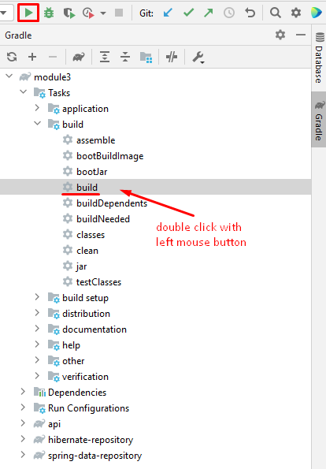
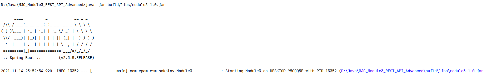
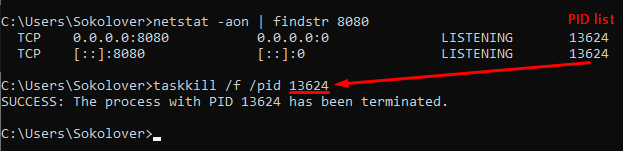

### To deploy application

1) Install MySQL database on PC
2) Open "MySQL 8.0 Command Line Client" and execute command "use mjc" to switch application database
3) Run scripts in terminal from step 2:
    - appendix/module4/create_database_schema_module4.sql
    - insert scripts from appendix/module4/dump_after_inserting_a_lot_of_rows.sql
4) Select needed repository submodule (see below "To change repository type (Hibernate/Spring JPA) comment unwanted repository in")
5) Run application (see below "To run application from terminal")

### To run application from terminal:

1) Build application via running next buttons in Gradle menu:

- select module3->Tasks->build->build and click Run button

  or

- double click with left mouse button



2) To run application - in terminal execute next command:

```
[path_to_project]\MJC_Module3_REST_API_Advanced>java -jar build/libs/module3-1.0.jar
```

_Example in IntellijIDEA:_



3) To stop application:

- run cmd.exe as an Administrator
- enter command ```netstat -aon | findstr <app_port_number>```
- copy PID (right value in string, for example: TCP 0.0.0.0:8080 0.0.0.0:0 LISTENING 13352 -> PID = 13352)
- enter command ```taskkill /f /pid [PID]``` (for example: ```taskkill /f /pid 13352```)

_Example:_



### To change repository type (Hibernate/Spring JPA) comment unwanted repository in:

1) build.gradle(module3) dependencies

Example:

```
   dependencies {
      implementation('org.springframework.boot:spring-boot-starter-web')
      implementation project(":api")
      // implementation project(":spring-data-repository")
      implementation project(":hibernate-repository")
   }
```

2) build.gradle(submodule "api") dependencies

Example:

```
   dependencies {
      // implementation project(":spring-data-repository")
      implementation project(":hibernate-repository")
      
      // other dependencies ...
   }
```

### To open swagger-ui:

1) Run application
2) Go to http://localhost:<app_port_number>/swagger-ui/